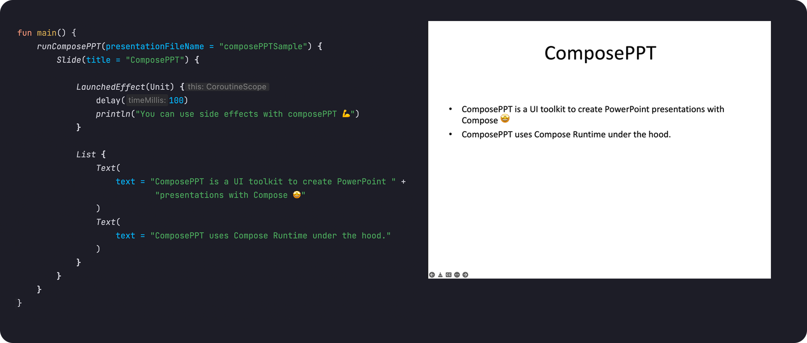

# ComposePPT

An experimental UI toolkit for creating PowerPoint presentations using Compose. Inspired by [Glance](https://developer.android.com/jetpack/androidx/releases/glance) and [Mosaic](https://github.com/JakeWharton/mosaic).

<p align="middle">
  
</p>

## Why?

This project is created just for fun and demonstrate the power of Compose Runtime 💪.

## Download 
First, add the composePPT dependency from maven central. You should also add the compose compiler to kotlin compiler classpath.

```kotlin
repositories {
    mavenCentral()
}

dependencies {
    implementation("com.fatihgiris.composePPT:composePPT:0.1.0")
    
    // Add the compose compiler to kotlin compiler classpath
    add(
        org.jetbrains.kotlin.gradle.plugin.PLUGIN_CLASSPATH_CONFIGURATION_NAME, 
        "org.jetbrains.compose.compiler:compiler:1.1.1" // Compatible with Kotlin 1.6.10
    ) 
}
```
## Usage

There is a single entry point called `runComposePPT` to create a presentation. 
In order to add a content, you must use `Slide` composable to add slides to a presentation first. 
Then you can place the composables inside the `Slide` composable. 

```kotlin
fun main() {
    runComposePPT {
        // Slide composable must be used to place other composables 
        Slide {
            Text("Hello from composePPT")
        }
    }
}
```

After running the above code, you will see a presentation file `composePPT.pptx` in your project root folder.
You can modify the presentation file name as below.

```kotlin
runComposePPT(presentationFileName = "myPresentation") { ... }
```

Calling `runComposePPT` several times is allowed if you want to create all presentations at once.

```kotlin
fun main() {
    runComposePPT(presentationFileName = "firstPresentation") { ... }
    runComposePPT(presentationFileName = "secondPresentation") { ... }
}
```

You can also use [side effects](#side-effects) and [`remember`](#state-in-composeppt) composable function. 

## Composables 

### `Slide` 
A slide element which is to be used to place the content. 

```kotlin
runComposePPT {
    Slide {
        Text(
            text = "ComposePPT is a UI toolkit to create PowerPoint " +
                    "presentations with Compose 🤩"
        )
    }
}
```

The above code will generate a slide without a title. If you want to have title, you can use `title` attribute.

```kotlin
runComposePPT {
    Slide(title = "ComposePPT") {
        Text(
            text = "ComposePPT is a UI toolkit to create PowerPoint " +
                    "presentations with Compose 🤩"
        )
    }
}
```

Additionally, you can create multiple slides as below.

```kotlin
runComposePPT {
    Slide {
        Text(text = "First slide")
    }
    Slide {
        Text(text = "Second slide")
    }
}
```

### `List`
A **vertical** list which can layout other composables. Horizontal list is currently **not** supported.
```kotlin
runComposePPT {
    Slide {
        List {
            Text(
                text = "ComposePPT is a UI toolkit to create PowerPoint " +
                        "presentations with Compose 🤩"
            )
            Text(
                text = "ComposePPT uses Compose Runtime under the hood."
            )
        }
    }
}
```

### `Text`
A core text element which can be styled using `TextStyle`.

```kotlin
runComposePPT {
    Slide {
        Text(text = "Here is a simple text with default styles")
    }
}
```

You can use `style` parameter to customize the style of a text.

```kotlin
runComposePPT {
    Slide {
        Text(
            text = "Here is a text with font size 30 and font color magenta",
            style = TextStyle(
                fontSize = 30f,
                fontColor = Color.MAGENTA
            )
        )
    }
}
```

## Side Effects
Side effects are supported in composePPT and any job will be awaited before the termination of the program. 

### `LaunchedEffect`
Any job started with `LaunchedEffect` inside a composable will be awaited before terminating the program.
It means that you can do long-running tasks.

```kotlin
runComposePPT {
    Slide {
        LaunchedEffect(Unit) {
            delay(1000)
            println("You will see this line and then program will terminate")
        }
    }
}
```

### `SideEffect`
```kotlin
runComposePPT {
    SideEffect { 
        // Will be executed on every recomposition
    }
}
```

### `DisposableEffect`
```kotlin
runComposePPT {
    DisposableEffect(Unit) {
        onDispose {
            // Will be executed before the disposal of the composition 
        }
    }
}
```

## Composition Locals

### `LocalTextStyle`
A composition local for the text style to be used in `Text` composable. You can provide a custom text style using this composition local.

Example:
```kotlin
runComposePPT {
    Slide {
        val smallRedTextStyle = TextStyle(
            fontSize = 10f,
            fontColor = Color.RED
        )

        CompositionLocalProvider(
            LocalTextStyle provides smallRedTextStyle
        ) {
            List {
                Text(
                    text = "This text is using the provided custom text style through " +
                            "LocalTextStyle composition local."
                )
                Text(
                    text = "If you check this and above text element there is no style set " +
                            "but they both have the same style which is different than default."
                )
            }
        }
    }
}
```

## State in ComposePPT
You can use `remember` composable function in the compose runtime inside any of the composePPT composable body.
Any changes made to the state objects will trigger recomposition.

Example: 
```kotlin
runComposePPT {
    var rememberedStateValue by remember { mutableStateOf(0) }

    LaunchedEffect(Unit) {
        delay(1000)
        rememberedStateValue = 1
    }

    DisposableEffect(Unit) {
        onDispose {
            assert(rememberedStateValue == 1) // True
        }
    }
}
```

## Limitations
You can only use `LaunchedEffect` to launch a coroutine. Even though using `rememberCoroutineScope` will work, it will not terminate the program. So you have to manually terminate it in order the presentation file to be created.

## License

```
Copyright 2022 Fatih Giris

Licensed under the Apache License, Version 2.0 (the "License");
you may not use this file except in compliance with the License.
You may obtain a copy of the License at

    https://www.apache.org/licenses/LICENSE-2.0

Unless required by applicable law or agreed to in writing, software
distributed under the License is distributed on an "AS IS" BASIS,
WITHOUT WARRANTIES OR CONDITIONS OF ANY KIND, either express or implied.
See the License for the specific language governing permissions and
limitations under the License.
```